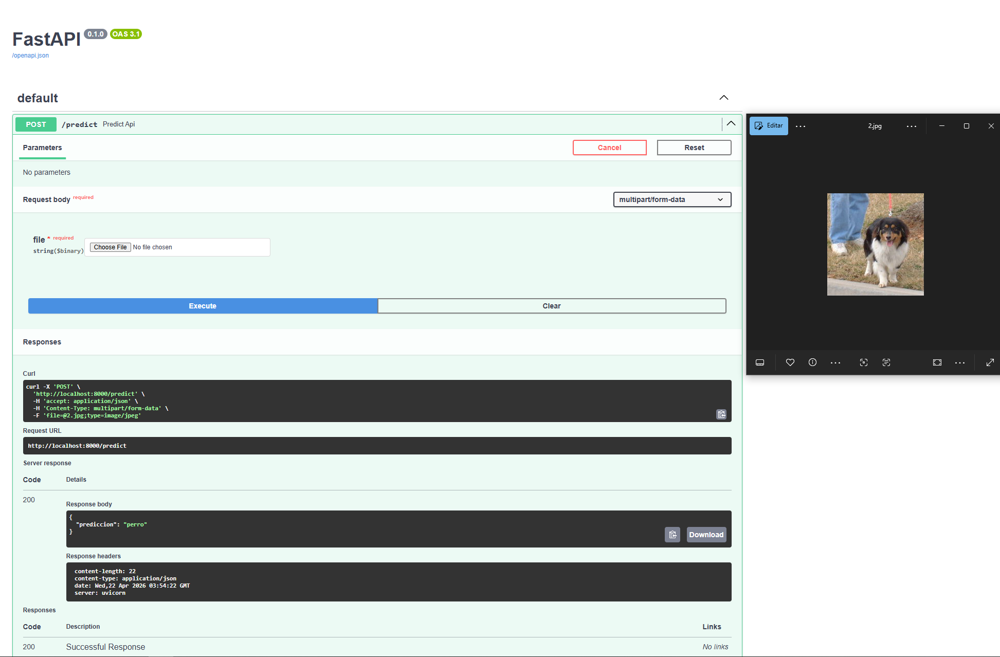

# Pipeline MLE de Clasificación de Imágenes (Gatos vs Perros)

Pipeline completo de Machine Learning para clasificación de imágenes, diseñado con un enfoque orientado a producción.

---

## 📸 Demo



---

## 🚀 Qué demuestra este proyecto

* Transfer Learning con MobileNetV2 (TensorFlow / Keras)
* Serving del modelo mediante FastAPI
* Integración de C++ (OpenCV) para preprocesamiento de imágenes
* Entorno reproducible en Linux (WSL)
* Resolución de problemas reales de portabilidad de modelos

---

## 🧠 Arquitectura

Cliente → FastAPI → Preprocesamiento en C++ → Inferencia en Python → Respuesta

---

## ⚙️ Stack tecnológico

* Python (TensorFlow, Keras, FastAPI)
* C++ (OpenCV)
* Linux (WSL)
* API REST

---

## ▶️ Cómo ejecutar

```bash id="b9s1xf"
python3 -m venv .venv
source .venv/bin/activate
pip install -r requirements.txt
uvicorn app.main:app --reload
```

Abrir en el navegador:

http://localhost:8000/docs

---

## 📌 Endpoint

**POST** `/predict`

Subir una imagen y obtener la predicción:

```json id="hpc7s0"
{
  "prediction": "perro"
}
```

---

## 🧪 Flujo del pipeline

1. Se recibe la imagen vía API
2. Se almacena temporalmente
3. Se preprocesa con C++ (OpenCV)
4. Se transforma a tensor
5. Se realiza la inferencia con el modelo
6. Se devuelve la predicción

---

## 💡 Insight de ingeniería (clave)

Durante el desarrollo surgieron problemas de compatibilidad al mover modelos entre entornos (versiones de TensorFlow/Keras).

Para resolverlos:

* se estandarizó el entorno
* se alinearon versiones
* se reconstruyó el pipeline para asegurar reproducibilidad

---

## 📈 Por qué es relevante

Este proyecto no se enfoca solo en el modelo, sino en:

* preparación para despliegue
* integración de sistemas (Python + C++)
* reproducibilidad
* debugging de problemas reales de ML

---

## 🔧 Mejoras futuras

* Containerización con Docker
* Logging y monitoreo
* Soporte para inferencia batch
* Versionado de modelos

---

## 👤 Autor

Leonel Saire Choque
